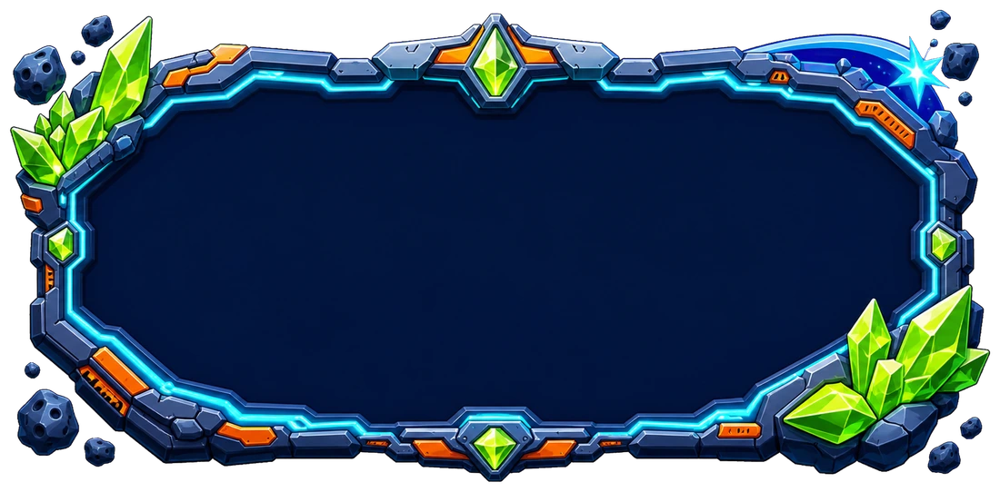

# There Is / There Are: Galaxy Patrol



**Galaxy Patrol** — бесплатная браузерная HTML-игра для тренировки английской грамматики у детей 7–10 лет. Ребёнок помогает инопланетянину Зиби очистить космический маршрут: читает предложение, смотрит на картинку и стреляет по астероиду с правильным ответом.

Тема игры: **There is / There are / There isn't / There aren't** и предлоги места (`in`, `on`, `under`, `behind`, `next to`, `between`, `near`, `in front of`).

## Как играть

1. Нажмите **Launch Patrol**.
2. Прочитайте предложение и рассмотрите картинку справа.
3. Выберите форму `is`, `are`, `isn't` или `aren't`.
4. Переместите Зиби на нужную линию и выстрелите по астероиду с ответом.
5. Пройдите 12 сигналов и победите финальный астероид.

У корабля три единицы щита. Ошибка или столкновение с астероидом снимает одну единицу. Серия из четырёх правильных ответов подряд восстанавливает щит.

## Управление

| Действие | Клавиатура | Мышь / сенсорный экран |
| --- | --- | --- |
| Перемещение между линиями | `↑` / `↓` или `W` / `S` | кнопки со стрелками |
| Выстрел | `Space` или `Enter` | кнопка **Fire** |
| Быстрый выбор ответа | — | нажать на нужный астероид |
| Пауза / продолжение | `Esc` | кнопка **Pause** |
| Начать заново | — | кнопка **Reset** |

Громкость музыки и эффектов регулируется отдельно на главном экране и во время миссии. Выбранная громкость и состояние звука сохраняются в браузере.

## Что есть в игре

- 24 задания с понятными мультяшными иллюстрациями;
- 12 случайных заданий при каждом запуске — по три на каждую грамматическую форму;
- разные медленно движущиеся астероиды и финальный раунд;
- щит, комбо, плазменный луч и игровые эффекты;
- музыка главного меню и миссии, звуки выстрела, верного и неверного ответа;
- управление с клавиатуры, мышью и сенсорными кнопками;
- адаптивный интерфейс для компьютера, планшета и телефона;
- работа без сервера, регистрации и подключения к интернету после загрузки файлов.

## Быстрый запуск

Откройте [`standalone/index.html`](standalone/index.html) в современном браузере. Игра полностью автономна: все изображения, музыка и звуки находятся в папке `standalone/assets`.

Для локальной проверки репозитория потребуется Node.js 22 или новее:

```bash
node --test tests/rendered-html.test.mjs
```

## Публикация на GitHub Pages

В репозитории подготовлен workflow [`.github/workflows/pages.yml`](.github/workflows/pages.yml). Он проверяет HTML и локальные ресурсы, а затем публикует папку `standalone`.

1. Создайте репозиторий на GitHub и отправьте проект в ветку `main`.
2. Откройте **Settings → Pages**.
3. В **Build and deployment → Source** выберите **GitHub Actions**.
4. Откройте вкладку **Actions** и дождитесь завершения workflow **Deploy Galaxy Patrol to GitHub Pages**.
5. Ссылка на игру появится в настройках Pages и в результате запуска workflow.

Файл `standalone/.nojekyll` отключает обработку Jekyll. Для самой игры не требуется npm-сборка: GitHub Pages получает готовый статический сайт.

## Структура

```text
standalone/
├── index.html                 # готовая игра и точка входа GitHub Pages
├── grammar-meteor-lab.html    # дополнительная точка входа
├── .nojekyll                  # публикация без Jekyll
└── assets/                    # изображения, музыка, звуки и иконки
tests/
└── rendered-html.test.mjs     # проверка заданий, ресурсов и workflow
```

Автор: [DEANDAL](https://vk.ru/deandal)
